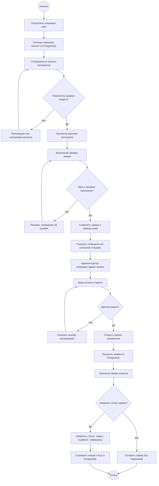
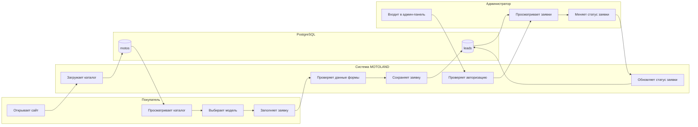

# Диаграмма деятельности проекта MOTOLAND

## Назначение диаграммы

Диаграмма деятельности описывает основной процесс работы сайта MOTOLAND: пользователь просматривает каталог, отправляет заявку, а администратор обрабатывает ее в закрытой панели управления.

Диаграмма показывает последовательность действий между публичным сайтом, базой данных PostgreSQL и админ-панелью.

## Основной сценарий

1. Покупатель открывает сайт MOTOLAND.
2. Система загружает каталог мотоциклов из базы данных.
3. Покупатель просматривает каталог и выбирает модель.
4. Покупатель заполняет форму заявки.
5. Система проверяет обязательные поля.
6. Если данные заполнены корректно, заявка сохраняется в PostgreSQL.
7. Администратор входит в закрытую панель.
8. Система проверяет логин и пароль.
9. Администратор просматривает заявку и меняет ее статус.
10. Обновленный статус сохраняется в базе данных.

## Activity Diagram

## Диаграмма деятельности с дорожками ответственности

## Описание альтернативных потоков

| Условие | Действие системы |
|---|---|
| Покупатель не заполнил имя или телефон | Система показывает сообщение об ошибке и не сохраняет заявку |
| Администратор ввел неверный логин или пароль | Система запрещает вход и показывает ошибку авторизации |
| Администратор не меняет статус заявки | Заявка остается в текущем статусе |
| Администратор скрывает мотоцикл | Система обновляет состояние модели, и она пропадает с публичного сайта |

## Итог

Диаграмма деятельности показывает полный цикл работы сайта: от просмотра каталога покупателем до обработки заявки администратором. Основные данные сохраняются в базе PostgreSQL, что обеспечивает централизованное хранение каталога и заявок.
