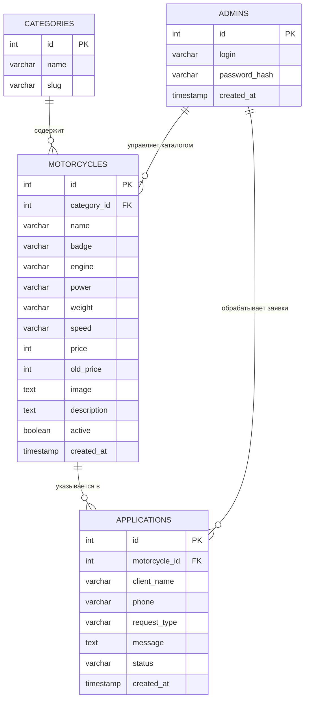

# ER-диаграмма проекта MOTOLAND

## Назначение базы данных

База данных предназначена для хранения каталога мотоциклов, заявок клиентов и данных администратора, который управляет содержимым сайта через закрытую панель.

В текущей реализации сайта используются основные таблицы `motos` и `leads`. Для дипломного проектирования структура нормализована и представлена через отдельные сущности: категории, мотоциклы, заявки и администраторы.

## Основные сущности

### `admins`

Хранит учетные записи администраторов сайта.

| Поле | Тип | Описание |
|---|---|---|
| `id` | integer, PK | Уникальный идентификатор администратора |
| `login` | varchar | Логин администратора |
| `password_hash` | varchar | Хэш пароля |
| `created_at` | timestamp | Дата создания учетной записи |

### `categories`

Хранит категории мотоциклов.

| Поле | Тип | Описание |
|---|---|---|
| `id` | integer, PK | Уникальный идентификатор категории |
| `name` | varchar | Название категории |
| `slug` | varchar | Системное имя категории |

Примеры категорий: эндуро, нейкед, туризм, спорт, классика.

### `motorcycles`

Хранит модели мотоциклов, отображаемые в каталоге.

| Поле | Тип | Описание |
|---|---|---|
| `id` | integer, PK | Уникальный идентификатор мотоцикла |
| `category_id` | integer, FK | Ссылка на категорию |
| `name` | varchar | Название модели |
| `badge` | varchar | Метка модели: хит, новинка, выгода |
| `engine` | varchar | Объем двигателя |
| `power` | varchar | Мощность |
| `weight` | varchar | Масса |
| `speed` | varchar | Максимальная скорость |
| `price` | integer | Текущая цена |
| `old_price` | integer, nullable | Старая цена |
| `image` | text | Ссылка на изображение |
| `description` | text | Описание модели |
| `active` | boolean | Отображается ли модель на сайте |
| `created_at` | timestamp | Дата добавления |

### `applications`

Хранит заявки клиентов с публичного сайта.

| Поле | Тип | Описание |
|---|---|---|
| `id` | integer, PK | Уникальный идентификатор заявки |
| `motorcycle_id` | integer, FK, nullable | Интересующая модель |
| `client_name` | varchar | Имя клиента |
| `phone` | varchar | Телефон клиента |
| `request_type` | varchar | Тип обращения |
| `message` | text | Комментарий клиента |
| `status` | varchar | Статус заявки |
| `created_at` | timestamp | Дата создания заявки |

Статусы заявки: новая, в работе, завершена.

## Связи между сущностями

- Одна категория может содержать много мотоциклов.
- Один мотоцикл может быть указан во многих заявках.
- Заявка может быть создана без выбора конкретного мотоцикла.
- Администратор управляет каталогом и заявками через закрытую панель.

## ER-диаграмма



## Логическая модель связей

```text
admins
  1 ─── ∞ motorcycles
  1 ─── ∞ applications

categories
  1 ─── ∞ motorcycles

motorcycles
  1 ─── ∞ applications
```

## Примечание к реализации

В программной реализации проекта структура может быть упрощена:

- таблица `motos` хранит данные мотоциклов вместе с названием категории;
- таблица `leads` хранит заявки клиентов;
- учетные данные администратора задаются через переменные окружения.

Для дипломного проектирования ER-диаграмма показывает нормализованную структуру, к которой можно привести базу при дальнейшем развитии проекта.
