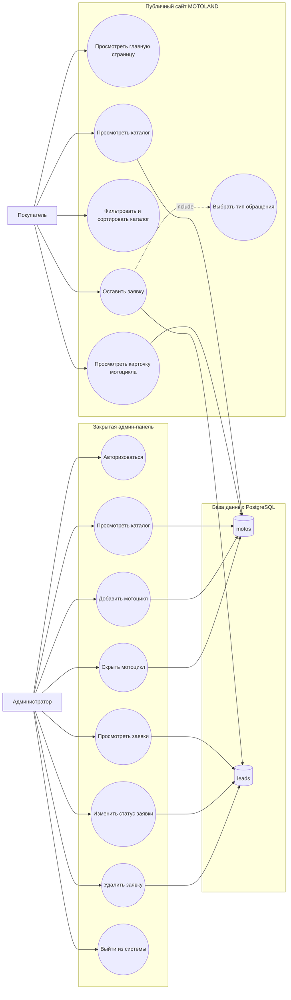

# Диаграмма прецедентов проекта MOTOLAND

## Назначение диаграммы

Диаграмма прецедентов показывает, какие действия выполняют пользователи системы и какие функции предоставляет сайт мотосалона MOTOLAND.

В системе выделены два основных актера:

- **Покупатель** — пользователь публичного сайта, который просматривает каталог и оставляет заявку.
- **Администратор** — сотрудник мотосалона, который работает с закрытой админ-панелью.

## Основные прецеденты

### Покупатель

Покупатель взаимодействует только с публичной частью сайта.

Основные действия:

- просмотр главной страницы;
- просмотр каталога мотоциклов;
- фильтрация и сортировка каталога;
- просмотр подробной информации о модели;
- отправка заявки;
- выбор типа обращения: консультация, тест-драйв, кредит, trade-in или сервис.

### Администратор

Администратор работает с закрытой панелью управления.

Основные действия:

- авторизация в админ-панели;
- просмотр заявок клиентов;
- изменение статуса заявки;
- удаление заявки;
- просмотр каталога мотоциклов;
- добавление новой модели;
- скрытие модели с публичного сайта;
- выход из админ-панели.

## Use Case Diagram

## Таблица прецедентов

| Актер | Прецедент | Описание |
|---|---|---|
| Покупатель | Просмотреть главную страницу | Пользователь открывает сайт и знакомится с мотосалоном |
| Покупатель | Просмотреть каталог | Пользователь видит доступные модели мотоциклов |
| Покупатель | Фильтровать и сортировать каталог | Пользователь подбирает модели по категории или цене |
| Покупатель | Просмотреть карточку мотоцикла | Пользователь открывает подробную информацию о выбранной модели |
| Покупатель | Оставить заявку | Пользователь отправляет контактные данные менеджеру |
| Покупатель | Выбрать тип обращения | Пользователь выбирает консультацию, тест-драйв, кредит, trade-in или сервис |
| Администратор | Авторизоваться | Администратор входит в закрытую панель управления |
| Администратор | Просмотреть заявки | Администратор видит список обращений клиентов |
| Администратор | Изменить статус заявки | Администратор переводит заявку в статус “новая”, “в работе” или “завершена” |
| Администратор | Удалить заявку | Администратор удаляет неактуальную заявку |
| Администратор | Просмотреть каталог | Администратор видит список моделей в базе данных |
| Администратор | Добавить мотоцикл | Администратор добавляет новую модель на сайт |
| Администратор | Скрыть мотоцикл | Администратор убирает модель с публичного сайта |
| Администратор | Выйти из системы | Администратор завершает сеанс работы |

## Краткое описание сценария работы

Покупатель открывает публичный сайт, просматривает каталог мотоциклов, выбирает интересующую модель и отправляет заявку. Заявка сохраняется в базе данных PostgreSQL. Администратор входит в закрытую панель управления, просматривает поступившие заявки, меняет их статусы и управляет каталогом мотоциклов.
